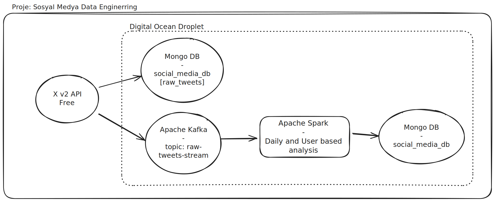

# Sosyal Medya Büyük Veri Uygulaması

*Bu proje, X (Twitter) API'sinden veri toplayan veya sahte veri üreten, bu veriyi ham olarak MOngoDB'ye yazan veya Apache Kafka ile taşıyan, Apache Spark ile işleyen ve analiz sonuçlarını MongoDB'de depolayan, uçtan uca bir veri mühendisliği projesidir.*

-----

## 1\. Projenin Amacı ve Kapsamı

Bu projenin temel amacı, sosyal medya verilerinin (tweet'ler) büyük veri teknolojileri kullanılarak nasıl toplanabileceğini, taşınabileceğini, işlenebileceğini ve analiz edilebileceğini göstermektir. Proje, belirli bir konu (query) etrafında dönen sohbetleri analiz ederek, aşağıdaki gibi kritik iş sorularına veri odaklı cevaplar üretmeyi hedefler:

  * Belirli bir konu hakkında en aktif kullanıcılar kimlerdir?
  * Konuyla ilgili en çok takipçiye sahip olan etkileyiciler (influencer'lar) kimlerdir?
  * "Ünlü" olarak kabul edilen ve edilmeyen hesapların sohbete katılım dağılımı nasıldır?
  * Düşük takipçili (potansiyel yeni veya sahte) hesapların platformdaki aktivite seviyesi nedir?

## 2\. Sistem Mimarisi



Proje, veri arşivleme (**Soğuk Yol**) ve gerçek zamanlı analiz (**Sıcak Yol**) ihtiyaçlarını karşılayan, çift yollu (dual-path) modern bir veri mimarisi üzerine kurulmuştur.

1.  **Veri Kaynağı (`X API v2`):** Projenin başlangıç noktasıdır. Belirli arama sorguları veya kullanıcı zaman akışları için tweet verileri bu API aracılığıyla çekilir.
2.  **Veri Toplama ve Yönlendirme (`twitter_ingestion_service.py`):** Python ile yazılmış bu servis, X API'sinden çektiği veya Fake Tweet üretimiyle oluşan ham tweet verisini iki farklı hedefe yönlendirir:
      * **Soğuk Yol -\> `MongoDB`:** Ham tweet verileri, gelecekteki derinlemesine analizler ve model eğitimleri için, zenginliğini kaybetmeden doğrudan `social_media_db.raw_tweets` koleksiyonuna arşivlenir.
      * **Sıcak Yol -\> `Apache Kafka`:** Aynı ham veri, anlık olarak işlenmek üzere `raw-tweets-stream` adlı Kafka topic'ine bir olay (event) olarak gönderilir.
3.  **Veri İşleme (`Apache Spark`):** `user_analysis.py` ve `daily_trend_analysis.py` adındaki Spark batch işleri, Kafka'daki veriyi okur (`Extract`), `public_metrics` gibi iç içe JSON yapılarını parse eder, yeni sütunlar ekleyerek veriyi zenginleştirir ve kullanıcı&günlük bazda analizler yapar (`Transform`).
4.  **Veri Depolama ve Analiz Sonuçları (`MongoDB`):** Spark ile yapılan analizlerin sonuçları (gruplama, sayma, etiketleme), yine MongoDB'deki farklı koleksiyonlara yazılır (`Load`).

## 3\. Kullanılan Teknolojiler

  * **Veri Akışı ve Mesajlaşma:** Apache Kafka (KRaft Modu)
  * **Veri İşleme:** Apache Spark 3.5.1 (PySpark)
  * **Veri Depolama:** MongoDB
  * **API Entegrasyonu:** Python, Tweepy (X API v2 için)
  * **Altyapı:** DigitalOcean Droplet (Ubuntu), Docker
  * **Gözlemlenebilirlik (Logging):** Python `logging` modülü,
  * **Geliştirme ve Yönetim:** Git & GitHub, `venv`, `~/.ssh/config` (SSH Tüneli)

## 4\. Proje Çıktıları ve Analiz Örnekleri

Spark ile yapılan analizler sonucunda aşağıdaki gibi değerli çıktılar üretilmiştir.

### Analiz 1: En Aktif Kullanıcılar

Konu hakkında en çok tweet atan kullanıcıların, tweet sayılarına göre sıralanmış listesi.


### Analiz 2 & 3: "Ünlü" Etiketlemesi ve Dağılımı

Tweet atan kullanıcılar, takipçi sayılarına göre (`>= 100,000`) "isFamous" olarak etiketlenmiştir.


Bu etiketleme sonucunda, konu hakkındaki tweet'lerin ne kadarının ünlü, ne kadarının ünlü olmayan hesaplardan geldiğinin dağılımı hesaplanmıştır.


### Analiz 4 & 5: Influencer ve Düşük Etkileşimli Hesap Analizi

Konuyla ilgili tweet atan en yüksek takipçili hesaplar (influencer'lar) ve potansiyel bot/yeni hesap olabilecek en düşük takipçili hesapların aktivite raporları.
Fenomenler:

Düşük Takipçili Hesaplar:


## 5\. Best Practice Yaklaşımlar

Bu projede, sadece çalışan bir sistem değil, aynı zamanda yönetilebilir, güvenli ve sağlam bir altyapı hedeflenmiştir:

  * **İzole Ortamlar:** Projenin her bir bileşeni (`api`, `spark-consumer` vb.) kendi izole Python sanal ortamına (`venv`) sahiptir.
  * **Merkezi Loglama:** `utils/logger.py` modülü ile tüm bileşenler için ayrı ayrı standart ve yönetilebilir bir loglama altyapısı kurulmuştur.
  * **Güvenli Erişim:** Tüm veritabanı ve arayüz bağlantıları (MongoDB Compass, Spark UI), dış dünyaya kapalı portlar üzerinden, güvenli bir **SSH Tüneli** aracılığıyla sağlanmaktadır.
  * **Hata Toleransı (Fault-Tolerance):** Servisler (`Kafka` vb.) `systemd` ile yönetilerek, çökme durumunda otomatik yeniden başlama yeteneğine kavuşturulmuştur. Spark işleri, `try-except` blokları ile daha sağlam hale getirilmiştir.
  * **Konfigürasyon Yönetimi:** API anahtarları gibi hassas bilgiler, `.env` dosyaları ve `configs` modülü aracılığıyla koddan ayrılmıştır.


## 6\. Proje Yapısı

Proje, her birinin kendi sorumluluğu ve sanal ortamı olan modüler bir yapıda organize edilmiştir:

```
sosyal-medya-data-eng/
├── configs/
│   └── settings.py             # .env'den ayarları okuyan modül
├── spark-consumer/
│   ├── venv-spark/
│   ├── user_analysis.py        # Kullanıcı bazlı, Spark  analizleri yapan script     
│   ├── daily_trend_analysis.py # Gün bazlı, Spark  analizleri yapan script
│   └── requirements.txt
├── twitter-to-mongo-kafka/  # Twitter'dan veri çeken servis 
│   ├── venv-producer/
│   ├── twitter_ingestion_service.py     # Veri çeken ve üretebilen ana script 
│   └── requirements.txt
├── utils/
│   └── logger.py               # Merkezi loglama modülü
├── logs/                       # Log dosyalarının tutulduğu klasör (git'e eklenmez)
├── .env                        # Hassas API anahtarlarının tutulduğu dosya (git'e eklenmez)
├── .gitignore
└── README.md
```

## 7\. Kurulum ve Çalıştırma

### Ön Gereksinimler

  * Sunucuda Java, Python3, `venv` ve `git` kurulu olmalıdır.
  * Sunucuda Apache Kafka ve MongoDB servisleri `systemd` ile çalışır durumda olmalıdır.
  * `pip install` ile her bir bileşenin kendi `venv`'i içine `requirements.txt` dosyasındaki bağımlılıklar kurulmalıdır.
  * Proje kök dizininde, `configs/settings.py`'nin okuyacağı geçerli API anahtarlarını içeren bir `.env` dosyası oluşturulmalıdır.

### Çalıştırma Adımları

1.  **[KENDİ PC'NDE - Terminal 1]:** Uzak sunucudaki servislere (MongoDB, Kafka) erişim için SSH tünelini başlat: `ssh sunucum`
2.  **[KENDİ PC'NDE - Terminal 2]:** Twitter'dan veri çekip Kafka ve MongoDB'ye gönderecek olan ingestion servisini başlat:
    ```bash
    cd sosyal-medya-data-eng/
    source twitter-to-mongo-kafka/venv-producer/bin/activate
    python3 -m twitter-to-mongo-kafka.twitter_ingestion_service
    ```
3.  **[SUNUCUDA - Terminal 3]:** Kafka'ya gelen veriyi işleyecek olan Spark batch işini gönder:
    ```bash
    cd sosyal-medya-data-eng/
    # Gerekli ortam değişkenlerini ayarla ve script'i çalıştır
    sudo \
      PYSPARK_PYTHON=./spark-consumer/venv-spark/bin/python \
      PYTHONPATH=$(pwd) \
      spark-submit \
        --packages org.apache.spark:spark-sql-kafka-0-10_2.12:3.5.1,org.mongodb.spark:mongo-spark-connector_2.12:10.3.0 \
        spark-consumer/user_analysis.py raw-tweets-stream
    ```
